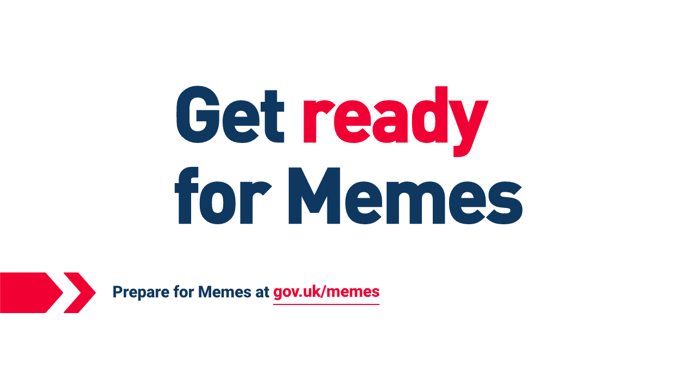
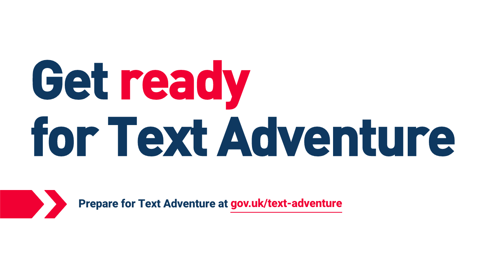

# Brexit

Get ready for [blank], inspired by @readyforspoons.

Code is based on [getreadyfor](https://github.com/cool-robot-pals/getreadyfor).

## Usage

Add the word that you want at the end of the url like so:

`iamrifki.github.io/brexit/?text=memes`

You can even do sentences with spaces in it.

`iamrifki.github.io/brexit/?text=text adventure`

## License
MIT © Dania Rifki.
